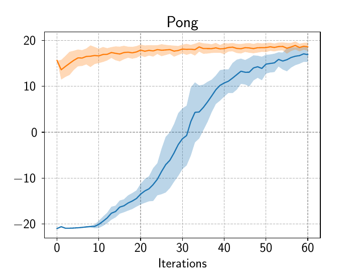

# Consolidation for Transfer in Reinforcement Learning

This anonymous repository contains the code developed for the submitted paper ["Experiments in Neural Consolidation for Transfer in Reinforcement Learning"](paper_link).

This code is a fork from [Google's Dopamine repository](dopamine), a research framework for fast prototyping of reinforcement learning.
The installation process, prerequisites and requirements are the same as for the Dopamine code and can be found on the README of the basis repository.

In particular, we reuse the [gin](gin-config) tool to describe and parametrize experiments.
The AMN experiments can be reproduced by running:

```
python3 -um dopamine.discrete_domains.llamn_train \
        --base_dir=results/ \
        --gin_files=dopamine/agents/llamn_network/config/llamn.gin
```

while the transfer experiments can be reproduced by running:

```
python3 -um dopamine.discrete_domains.transfer_train \
        --base_dir=results/
        --gin_files=dopamine/agents/rainbow/config/transfer_rainbow.gin
```

# Experimental Details

The network architecture can be found in `dopamine/discrete_domains/llamn_atari_lib.py`: both expert agents and AMN agents are comprised of three convolutional layers followed by two fully connected layers.

All layers except the action outputs are followed with a rectifier non-linearity.
The hyperparameters are defined in the gin config files `dopamine/agents/llamn_network/configs/llamn.gin` and are mainly the same as in the [Actor-Mimic paper](AMN).


# Results

## Alterating loss vs Composite loss

| Breakout | Carnival | Pong | Space Invaders | Video Pinball |
| :------: | :------: | :--: | :------------: | :-----------: |
|  |  |  |  |  |


## Frequency switch: steps by steps vs episodes by episodes

| Breakout | Carnival | Pong | Space Invaders | Video Pinball |
| :------: | :------: | :--: | :------------: | :-----------: |
|  |  |  |  |  |


## Transfer from Passive phase to Active phase

| Breakout | Carnival | Pong | Space Invaders | Video Pinball |
| :------: | :------: | :--: | :------------: | :-----------: |
|  |  |  |  |  |


## Feature Concatenation

| Breakout | Pong | Space Invaders | Video Pinball |
| :------: | :--: | :------------: | :-----------: |
|  |  |  |  |


## Transfer to New Unseen Games

| Breakout | Carnival | Pong | Space Invaders | Video Pinball |
| :------: | :------: | :--: | :------------: | :-----------: |
|  |  |  |  |  |


## Direct Transfer

| Breakout | Carnival | Pong | Space Invaders |
| :------: | :------: | :--: | :------------: |
|  |  |  |  |


[dopamine]: https://github.com/google/dopamine
[AMN]: https://arxiv.org/abs/1511.06342
[gin-config]: https://github.com/google/gin-config
[paper_link]:https://
